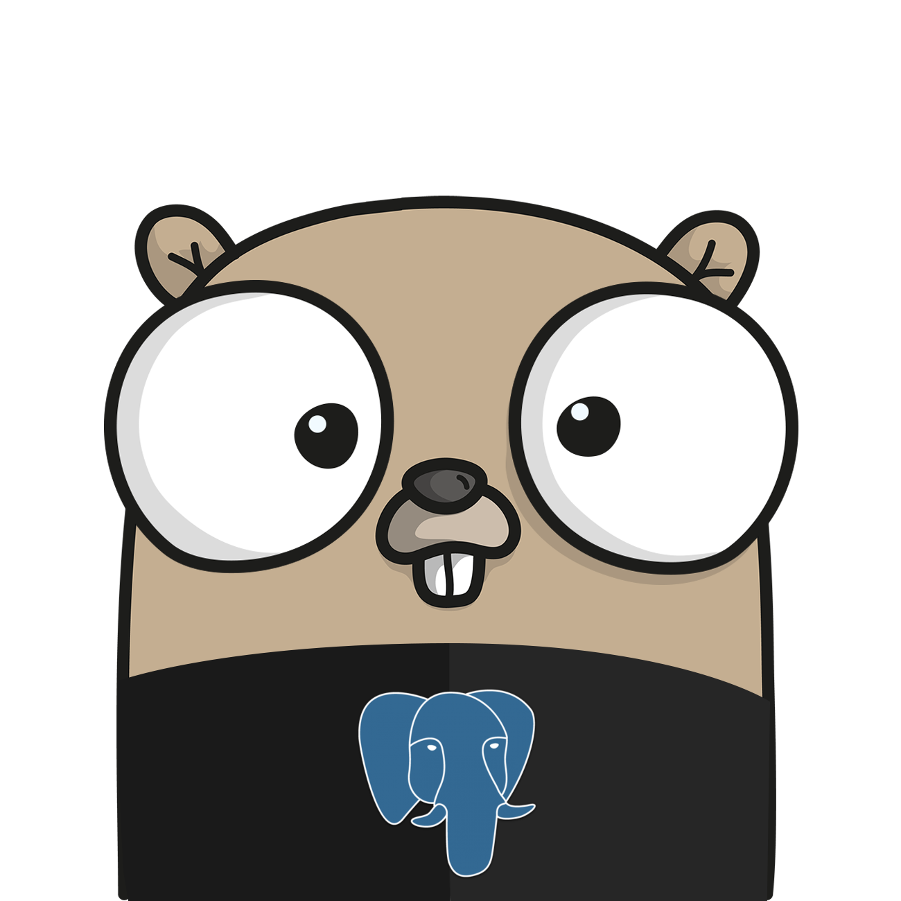

<p align="center"></p>

# embedded-postgres v2

Run real PostgreSQL in your tests. Each test gets its own database, an available
port, and automatic cleanup. A CLI provides the same lifecycle for other languages.
The production Go packages have **zero third-party dependencies**.

**v2 is available as an alpha release.** Requires Go 1.26 or newer. Upgrading from
v1? Start with the [migration guide](docs/migration-v2.md).

## A database scoped to a test

```bash
go get github.com/fergusstrange/embedded-postgres/v2@v2.0.0-alpha.1
```

```go
package app_test

import (
    "testing"

    "github.com/fergusstrange/embedded-postgres/v2/eptest"
)

func TestRepository(t *testing.T) {
    pg := eptest.Start(t)
    connectionURL := pg.ConnectionURL()
    _ = connectionURL // Open your chosen Go driver/pool here.
    // Register pool cleanup after eptest.Start, so the pool closes first.
}
```

The first start downloads PostgreSQL and the matching supervisor; later starts
reuse the cache. PostgreSQL needs the [native libraries for your OS](docs/non-root.md).
Choose your own SQL driver, and close connection pools before test cleanup.

For configuration, import `github.com/fergusstrange/embedded-postgres/v2` as `postgres`
and pass `postgres.DefaultConfig().Port(0).Database("app_test")` to `eptest.Start`.
Use `eptest.Run` to share one instance across `TestMain`. See
[testing patterns](docs/testing.md) for parallel tests and suite setup.
Source checkouts, local replacements and vendored tests need an explicitly selected
supervisor; see the [migration guide](docs/migration-v2.md).

## Use the CLI with any test runner

```bash
curl -fsSL https://raw.githubusercontent.com/fergusstrange/embedded-postgres/master/install/install.sh | bash
export PATH="$HOME/.local/bin:$PATH"
embedded-postgres exec -- npm test
```

`exec` starts PostgreSQL, supplies `DATABASE_URL` and the usual `PG*` variables,
runs your command, then stops the database and returns the command's exit code.
Replace `npm test` with your test command. The CLI chooses an available port and
a random password. See the [CLI guide](docs/cli.md) for foreground and background
instances, Windows installation, configuration files and wrapper integration.

## Direct lifecycle use

```go
pg := postgres.NewDatabase(postgres.DefaultConfig().Port(0))
if err := pg.StartContext(ctx); err != nil {
    return err
}
defer pg.Close()
// pg.ConnectionURL() and pg.GetPort() now contain the actual endpoint.
```

Canceling the lifetime context also closes the server. `Close` is idempotent;
`Start` and `Stop` preserve the familiar v1 calling pattern. `StopContext` can
stop waiting when its context expires while cleanup continues. `Done` closes when
cleanup finishes, `Err` reports a lifecycle failure, and `Logs` retains a bounded,
password-redacted tail for diagnostics.

An independent supervisor watches a dedicated owner pipe. An unrecovered panic,
`os.Exit`, or forced owner termination closes that pipe and triggers PostgreSQL
shutdown. The library installs no process-wide signal handlers. Userspace cannot
guarantee graceful shutdown after whole-machine failure or simultaneous forced
termination of the supervisor and PostgreSQL. Persistent data still requires the
same care as any PostgreSQL cluster.

## Storage and extension points

```go
config := postgres.DefaultConfig().Port(0).Storage(postgres.Storage{
    CacheDir: "/path/to/shared-cache",
    WorkDir:  "/path/to/temporary-parent",
    DataDir:  "/path/to/persistent-cluster", // Omit for disposable test data.
})
```

- `CacheDir` holds verified, immutable installations shared under process leases.
  Stopping an instance retains reusable binaries. `PruneCache` removes unused
  recognized entries and preserves active installations and unknown files.
- `WorkDir` is a parent for private, uniquely named temporary children. The caller's
  parent is never erased. Each normal lifecycle removes its own child.
- `DataDir` is persistent and never automatically removed. A nonempty unrelated
  directory or a cluster from a different PostgreSQL major is rejected.

Replace the whole acquisition policy with `BinaryProvider`, use `LocalProvider`
for preinstalled PostgreSQL, or customize `DownloadProvider` for mirrors, HTTP
transports and offline caches. Lifecycle hooks support preparation and migrations
with reverse-order cleanup. Native extensions such as pgvector/PostGIS can live in
caller-owned distributions without becoming core dependencies. See
[provider and hook contracts](docs/providers-and-hooks.md) and
[compiled reference implementations](examples/custom/provider.go).

Root callers must select an existing non-root Unix identity with
`RunAs(postgres.User{UID: 10001, GID: 10001})`. The caller retains its identity;
PostgreSQL and its utilities run as the selected account. Windows uses a restricted
token and process Job Objects. Follow the [non-root reference guide](docs/non-root.md)
for container setup, directory ownership, and native library requirements.

## Defaults and supported versions

| Setting | Library default |
|---|---|
| PostgreSQL | `V18` / 18.6.0 |
| Role, password, database | `postgres` |
| Port | 5432; use `Port(0)` for parallel tests |
| Locale / encoding | `C` / `UTF8` |
| Startup / shutdown | 2 minutes / 10 seconds |
| Data / workspace | Private disposable instance |
| Cache | `os.UserCacheDir()/embedded-postgres/v2` |

`V15`, `V16`, `V17`, `V18` pin 15.19.0, 16.15.0, 17.11.0, 18.6.0. PostgreSQL
14 and older are excluded. PostgreSQL uses a
[five-year major-version support policy](https://www.postgresql.org/support/versioning/),
not a separate LTS edition. Binary checksums are pinned in the reviewed manifest;
automatic library releases do not silently change those pins.

Native CI covers Linux and macOS AMD64/ARM64, Windows AMD64, and Windows ARM64
with x64 PostgreSQL emulation. Alpine 3.21 AMD64 has a separate musl integration job (the upstream bundle
requires ICU 74; see the platform guide).
Other Linux architectures can use a source-built companion when a pinned bundle
exists. FreeBSD needs a custom distribution and companion; it is not in the
supported release matrix.

## Development

[Contributing](CONTRIBUTING.md) explains local tests and coverage.
[Build and release policy](docs/releases.md) describes the native GitHub Actions
matrix, 90% production coverage gate, security checks and automatic master releases.
Download published binaries and read release notes on the
[releases page](https://github.com/fergusstrange/embedded-postgres/releases).

Thanks to [theseus-rs/postgresql-binaries](https://github.com/theseus-rs/postgresql-binaries)
for gzip distributions, the PostgreSQL project, and
[zonkyio/embedded-postgres-binaries](https://github.com/zonkyio/embedded-postgres-binaries)
for powering v1. The logo uses [Gopherize Me](https://gopherize.me).
